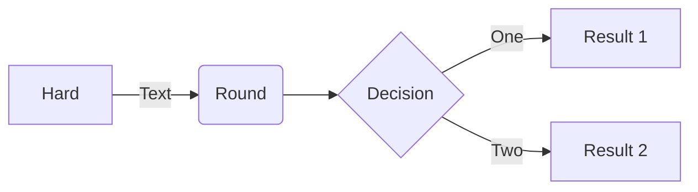

# This is the **HOMEPAGE**.
Refer to [Markdown](http://daringfireball.net/projects/markdown/) for how to write markdown files.
## Quick Start Notes:
1. Add images to the *images* folder if the file is referencing an image.

## Timer test:

## Added Vale
2023-05-20 [Vale.sh](https://vale.sh/)
Vale is an open-source, command-line tool used for syntax-aware text proofreading. It can help enforce style and consistency across various types of content.

2023-05-20 [Structure - Vale.sh](https://vale.sh/docs/vale-cli/structure/)
2023-05-20 [Config Generator - Vale.sh](https://vale.sh/generator)

but this is still experimental.

