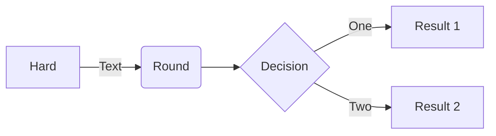

# This is the **HOMEPAGE**.
Refer to [Markdown](http://daringfireball.net/projects/markdown/) for how to write markdown files.
## Quick Start Notes:
1. Add images to the *images* folder if the file is referencing an image.

## Timer test:

